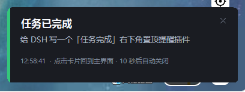

# dsh-completion-alert · 任务完成提醒

一个 DeepSeek Harness（DSH）插件：**任务跑完时，如果主界面不在最上层，就"叮"一声并在屏幕右下角弹出一张置顶缩略卡片；点卡片即可把 DSH 主界面拉到最前，并定位到刚完成的那次会话。**



```
agent 停下来 ──► 宿主端判定「任务完成」
                     │
                     ├─ 浏览器端一直在上报：主界面是否在最前？
                     │
                     ├─ 不在最前 ──► 播放合成"叮"声
                     │              └─► 右下角置顶卡片（不抢焦点）
                     │
                     └─ 在主界面最前 ──► 保持安静

点卡片 ──► 写"认领"文件 ──► 拉起 DSH 窗口（dsh://open + 强制置顶）
                     └─► 浏览器端 2.5 秒内轮询到，切换到该会话
```

## 功能

| 行为 | 说明 |
| --- | --- |
| 触发 | 宿主端监听 `agent/status`，某个会话的 agent 由 `running` 转为停止时判定任务结束（子代理的完成不会打扰你） |
| **审批提醒** | 监听会话审计事件 `approval/asked`：有工具在等你的批准时也弹同样的卡片，**卡片上写明是哪个工具、要做什么**（从 `tool/call` 的参数里取命令/路径等摘要） |
| **提问提醒** | 以纯观察者身份挂在 `user-questions/request` 瀑布上（`return next()` 原样放行）：agent 提问并卡住时弹卡片，标题就是问题正文 |
| 静音条件 | 浏览器端持续上报 `document.hasFocus()` / `visibilityState`；**主界面在前台时不提醒**，后台超过 2 分钟无上报也会提醒（宁可提醒，不漏报） |
| 提示音 | 插件自带的合成 "叮"（三个衰减正弦分音，写入临时目录的 WAV，无需联网、无版权问题） |
| 缩略卡片 | PowerShell + WinForms 置顶窗口，右下角 16px 边距，圆角、深色、带状态色条；`WS_EX_NOACTIVATE` + `ShowWithoutActivation`，**弹出时不抢你的输入焦点** |
| 点击卡片 | ① 记录要打开的会话；② **查找窗口时包含隐藏窗口**（DSH 收进托盘后 `IsWindowVisible=false`），用 `ShowWindowAsync(SW_SHOW)` + `SetWindowPos(SWP_SHOWWINDOW)` 唤出，再强制置顶；都失败才退回 `dsh://open`（给足 12 秒，冷启动 Electron 也够）；③ 浏览器端轮询到认领后 `openSession()` 定位任务 |
| 自动关闭 | 默认 9 秒；审批/提问卡片默认 20 秒（人可能不在机器前），右上角 ✕ 可立即关闭 |
| 异常场景 | 出错 / 被阻断 / 达到输出上限会显示不同文案与颜色；用户自己按停止（`aborted`）默认不提醒 |

状态色条：完成=绿、审批=蓝、提问=紫、出错/阻断=红、其它=琥珀。

## 安装

DSH 桌面版的 profile 由应用自己管理，`dsh plugin --profile desktop` 会被拒绝，所以用脚本安装：

```powershell
powershell -ExecutionPolicy Bypass -File install.ps1
```

脚本按插件管理器认可的**本机包布局**安装，这样它会出现在应用「插件」页的「**已安装**」分组里，并带开关：

```
<profile>\plugins\dsh-completion-alert        包本体
<profile>\node_modules\dsh-completion-alert   指向包本体的 junction
<profile>\package.json
    dependencies["dsh-completion-alert"] = "file:plugins/dsh-completion-alert"
    dsh.profile.bundles                 += "dsh-completion-alert"
```

> 只写进 `dsh.profile.bundles` 而不写 `dependencies` 也能加载，但插件页会把 `installed=false && optional=false` 的条目过滤掉——这就是它一开始不出现在那个界面里的原因。

然后：

1. **重启 DeepSeek Harness**（bundle 在启动时装载；宿主端改动也必须重启）
2. 刷新插件页：`dsh-completion-alert` 出现在「已安装」分组，可直接开关
3. 自检：`curl http://127.0.0.1:19387/completion-alert/ping` 应返回 `{"ok":true,...}`

卸载：

```powershell
powershell -ExecutionPolicy Bypass -File install.ps1 -Uninstall
```

也可以在插件页直接移除（它会走管理器的 `pnpm remove`；`plugins\` 下的包本体会保留，需要时手工删除）。

### 从克隆的仓库安装

```powershell
git clone https://github.com/jiachenleo9-create/dsh-completion-alert.git
cd dsh-completion-alert
powershell -ExecutionPolicy Bypass -File .\install.ps1
```

## 配置

在 profile 目录的 `cordis.patch.yml` 里按 id 覆盖（改完刷新页面 / 重启应用）：

```yaml
- id: completion-alert
  name: 'dsh-completion-alert'
  config:
    enabled: true            # 总开关
    onlyWhenUnfocused: true  # 只在主界面不在最前时提醒（核心行为）
    sound: true              # 播放"叮"
    popup: true              # 弹出右下角卡片
    popupSeconds: 9          # 完成卡片自动关闭秒数（3–120）
    corner: br               # 位置：br 右下 / bl 左下 / tr 右上 / tl 左上
    notifyOnAbort: false     # 用户手动停止的任务是否也提醒
    approvalAlerts: true     # 有工具等待批准时提醒（卡片写明审批内容）
    approvalSeconds: 20      # 审批卡片存活秒数
    questionAlerts: true     # agent 提问并卡住时提醒
    questionSeconds: 20      # 提问卡片存活秒数
    minGapMs: 5000           # 两张卡片之间的最小间隔
    debounceMs: 1200         # agent 停止后的稳定等待，避免误报
```

只想要声音、不要卡片：`popup: false, sound: true`。不想被审批打断：`approvalAlerts: false`。

## 自检与排查

| 现象 | 处理 |
| --- | --- |
| 没有任何反应 | 确认 `curl http://127.0.0.1:19387/completion-alert/ping` 返回 `ok`；否则说明宿主端没装载（未重启 / bundle 没写进 package.json） |
| ping 里 `hasClientReport: false` | 浏览器端没跑起来：刷新页面；确认 `dsh.client` 声明与 `lib/client.js` 存在 |
| 想立刻看效果 | `curl http://127.0.0.1:19387/completion-alert/test`：无视前台状态，直接弹一次卡片并播放提示音；`?kind=approval` / `?kind=question` 预览另外两种样式 |
| 收进托盘后点卡片没反应 | 宿主端需为包含「隐藏窗口查找 + 唤出」的新版本（`lib/index.js` 改动要重启 DSH 才生效） |
| 有卡片但不置顶 / 点了没反应 | 卡片脚本在无 WinForms 环境下会降级；检查卡片是否被其它置顶窗口遮挡 |
| 想留诊断日志 | 宿主端会把卡片日志写到 `%TEMP%\dsh-completion-alert\card.log`（`reveal ... visible=... raised=...` 就是关键行） |

## 已知限制

- **仅 Windows**：置顶卡片依赖 PowerShell + WinForms；其它平台只写日志不弹窗（`ctx.logger` 记录）。
- 卡片出现约有 1–2 秒延迟（PowerShell 进程启动 + C# 辅助类编译）；每次提醒一个进程，关闭即退出。
- 点击后的会话定位依赖浏览器端存活；页面关闭时只保留"唤起窗口"这一步。
- 宿主端（`lib/index.js`）改动需要重启 DeepSeek Harness；客户端半（`lib/client.js`）改动刷新页面即可。
- 缩略卡片不使用系统通知通道，因此不受 Windows「专注助手 / 通知设置」影响。

## 目录结构

```
dsh-completion-alert/
├─ package.json        # dsh.bundle + dsh.client 声明，无构建步骤
├─ cordis.patch.yml    # bundle 层：插入 completion-alert 这一行
├─ lib/index.js        # 宿主端：事件判定、焦点状态、HTTP 路由、调度卡片
├─ lib/client.js       # 浏览器端：上报焦点、轮询认领、打开会话
├─ assets/notify.ps1   # 右下角置顶卡片（WinForms + Win32 置顶）
├─ docs/               # 截图
├─ install.ps1         # 安装 / 卸载
├─ LICENSE             # MIT
└─ README.md
```

## 参考与致谢

做之前先把 DSH 插件生态翻了一遍，以下几点思路来自这些 MIT 项目的公开实现（代码为本仓库重写，未复制 GPL 项目）：

- [dsh-thinking-notifier](https://github.com/6-debug-6/dsh-thinking-notifier)——用 PowerShell 做真正的置顶无边框角标窗口。
- [Favio8/dsh-plugins](https://github.com/Favio8/dsh-plugins)——宿主端 `agent/status` 判定任务结束 + 合成提示音 + 右下角卡片。
- [Mvyvn/dsh-desktop-notify](https://github.com/Mvyvn/dsh-desktop-notify)（GPL-3.0，仅参考设计）——「焦点时静音」的做法：浏览器端上报 `document.hasFocus()` / `visibilityState`。
- [TelosmaYLX/dsh-session-notify](https://github.com/TelosmaYLX/dsh-session-notify)——`turn/end` 原因分类与失焦/聚焦分流。

## 许可

MIT，见 [LICENSE](LICENSE)。
